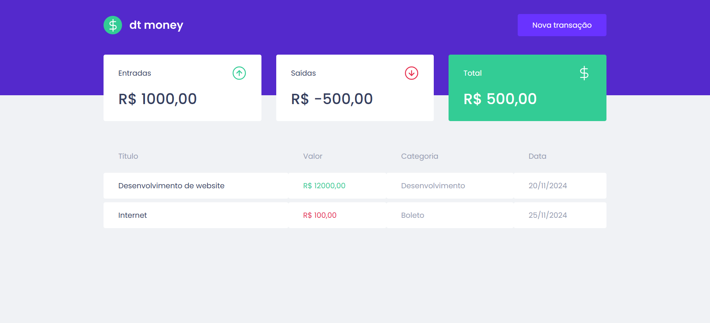

<h1 align="center">
  
</h1>

<h3 align="center">
  DT Money
</h3>

<p align="center">Aplicação de controle financeiro utilizando o ReactJS</p>

<p align="center">
  <a href="#como-executar-o-projeto">Como executar o projeto</a>&nbsp;&nbsp;&nbsp;|&nbsp;&nbsp;&nbsp;
  <a href="#anotações">Anotações</a>
</p>

<p align="center">Front-end</p>

<p align="center">
  
</p>

## Como executar o projeto

### Clonar este repositório

```bash
git clone https://github.com/eliasmcastro/rocketseat-ignite-reactjs-dt-money.git
```

### Requisitos

- [Node.js](https://nodejs.org) na versão 16.14.0
- [Yarn](https://yarnpkg.com) na versão 1.22.5

### Passos para a execução

**1. Executar aplicação**

Instalar as dependências do projeto

```bash
yarn
```

Iniciar a aplicação

```bash
yarn start
```

A aplicação começará a ser executada em http://localhost:3000

## Anotações

### Criação do projeto

- `yarn create react-app dtmoney --template typescript` cria um projeto react utilizando o [create-react-app](https://create-react-app.dev/)

### Styled Components

- O styled-components permite que você escreva estilos CSS dentro de componentes ReactJS, utilizando a sintaxe do JavaScript
- `yarn add styled-components` para instalar o Styled Components
- `yarn add @types/styled-components -D` para instalar a definição de tipo da biblioteca styled-components
- Recomendado utilizar a extensão vscode-styled-components do VSCode para trabalhar com o styled-components

### Configurando MirageJS

- O MirageJS é uma biblioteca de simulação de API
- `yarn add miragejs` para instalar o MirageJS

### Axios

- O Axios é uma biblioteca JavaScript que permite fazer requisições HTTP
- `yarn add axios` para instalar o Axios

### React Modal

- O React Modal é uma biblioteca de componente para criar modais em ReactJS
- `yarn add react-modal` para instalar o React Modal
- `yarn add @types/react-modal -D` para instalar a definição de tipo da biblioteca react-modal

### Polished

- O Polished é uma biblioteca de utilitários JavaScript para facilitar a manipulação de estilos CSS
- `yarn add polished` para instalar o polished